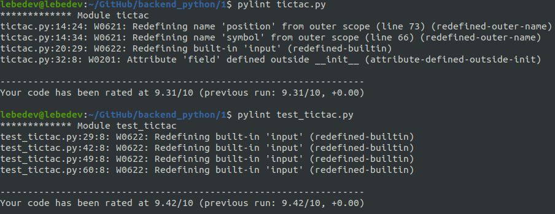

# Реализация игры крестики-нолики в виде класса

## Описание проекта
Программа, реализующая игру в крестики-нолики для двух игроков с одного компьютера.

## Запуск игры

```bash
python3 tictac.py
```

## Запуск тестов

```bash
python3 -m unittest discover
```

## Pylint



